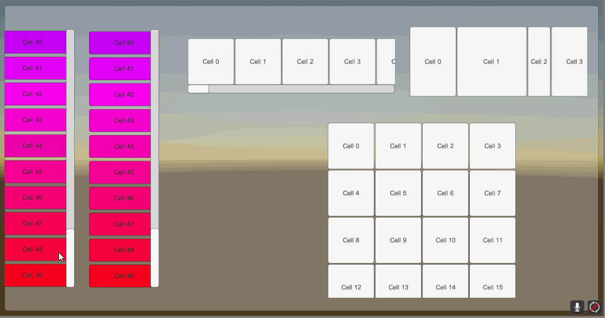
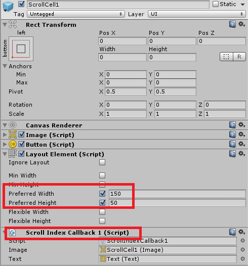
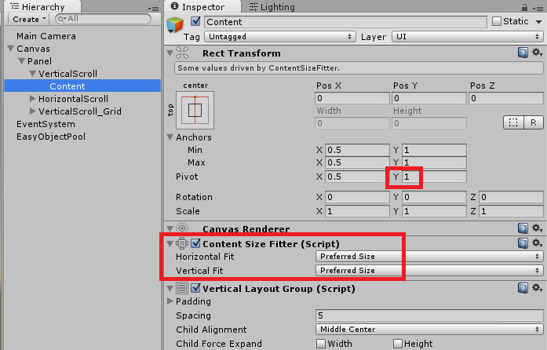

# Loop Scroll Rect

## v1.01

These scripts help make your ScrollRect `Reusable`, because it will only build cells when needed. If you have a large number of cells in a scroll rect, you absolutely need it! It will save a lot of time loading and draw call, along with memory in use, while still working smoothly.

中文说明请看[这里](http://qiankanglai.me/misc/2015/08/15/LoopScrollRect/)。

## Demo

Demo for Loop Scroll Rect. Each cell knows its index, and it is able to modify its content/size/color easily.

Demo without mask. As you can see, the cells are only instantiated when needed and recycled.

Demo for reverse direction.

## Introduction

The original idea comes from @ivomarel's [InfinityScroll](https://github.com/ivomarel/InfinityScroll). After serveral refactorisations, I almost rewrite all the codes:
- Avoid using `sizeDelta` directly since it doesn't always mean size
- Support GridLayout
- Avoid blocking when dragging back
- Take advantage of pool rather than instantiate/destroy every time
- Improve some other details for performance
- Supports reverse direction

Also, I modified [Easy Object Pool](https://www.assetstore.unity3d.com/cn/#!/content/31928) for recycling the cells. 

**Warning**: My scripts copies the `ScrollRect` from [UGUI](https://bitbucket.org/Unity-Technologies/ui) 5.1 rather than inherit `ScrollRect` like InfinityScroll, because I need to modify some private variants to make dragging smooth. All my codes is wrapped with comments like `==========LoopScrollRect==========`, making maintaining a litter easier.

### Infinite Version

If you need scroll infinitely, you can simply delete codes about `itemTypeStart`, `itemTypeEnd` in my scripts. I've completed a simple infinite version, for which you can open by adding `INFINITE` into define symbols.

## Example: Loop Vertical Scroll Rect

These steps may be confusing, so you can just open the demo scene and copy & paste :D

You can also remove EasyObjPool and use your pool instead.

1. Prepare cell prefabs
    - The cell needs `Layout Element` attached and preferred width/height
    - You should add a script receiving message `void ScrollCellIndex (int idx) `

2. Prepare EasyObjectPool with different cell prefabs

3. Attach `LoopVerticalScrollRect` and `Mask` to the ScrollRect gameObject. I highly suggests you trying modify these when playing.
	- Clear Cells: remove existing cells and keep uninitialized
	- Refill Cells: initialize and fill up cells
	- Init in Start: call Refill cells automatically when Start
	- Prefab Pool: the EasyObjPool gameObject
	- Prefab Pool Name: the corresponding pool in step 2
	- Total Count: How many cells are available (index: 0 ~ TotalCount-1)
	- Threshold: How many additional pixels of content should be prepared before start or after end?
	- ReverseDirection: If you want scroll from bottom or right, you should toggle this

4. Attach `Content Size Filter` and `Vertical Layout Group` to the Content gameObject. Pay attention to the pivot. 

If you need scroll from top or left, setting content's pivot to 1 and disable ReverseDirection. Otherwise, you should set 0 to pivot and enable ReverseDirection (I have made `VerticalScroll_Reverse` in the demo scene as reference).